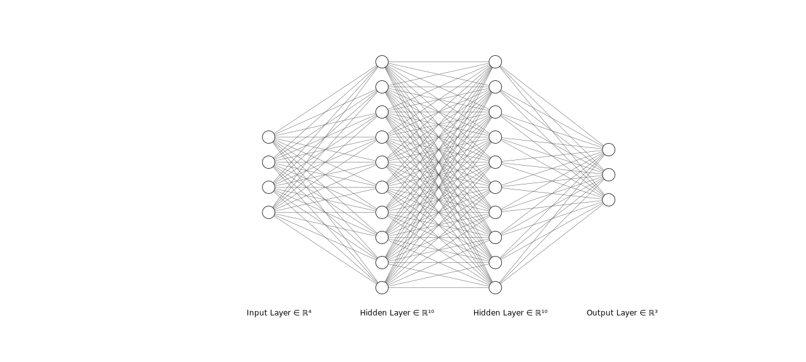
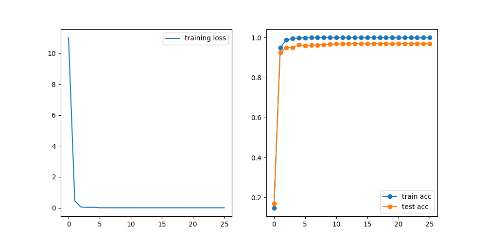

# PyNet
 Use numpy to build neuron network
 基于Numpy的神经网络

## 多层神经网络

我们能像下面这样初始化神经网络:

```python
from Net import net

net = Net(
    (4, "linear"),
    (10, "relu"),
    (10, "relu"),
    (3, "softmax"),
    criterion="ce"
)
```

定义下面结构的神经网络:



激活函数为ReLU，以交叉熵为损失函数。定义优化器:

```python
from opimizers import Momentum

optim = Momentum(net.parameters(), lr=0.1, momentum=0.9)
```

然后给定数据集`X`和`y`，我们进行优化:

```python
output = net.forward(X) # 前向传播
net.backward(y)         # 反向传播
optim.step(*net.grads)  # 梯度下降
```

这样就可以对网络进行训练。

## 正则化

我们支持L1和L2正则化:

```python
net = Net(
    (4, "linear"),
    (10, "relu"),
    (3, "softmax"),
    criterion="ce",
    regularize="L2"
)
```

这样定义的网络是带有L2正则化的。

## 模型存取

通过调用`save_model`函数，我们可以将模型存储在model文件夹中；调用`load_model`则会将model文件夹中的模型加载到程序中:

```python
from net_io import load_model, save_model

net = net = Net(
    (4, "linear"),
    (10, "relu"),
    (3, "softmax"),
    criterion="ce",
)
save_model(net, "net") # 模型以文本形式存储到./model/net文件中
new_net = load_model("net") # 将./model/net中的模型加载到new_net
```

## 固定初始化

`data`文件夹中存储了一个长度为200000的数组，通过调用random_init函数，网络会按顺序从数组取值作为网络初始权重。如果网络过大，权重数超过200000，可以修改`random_gen.py`中的`N`，重新初始化元素。

## He初始化与Xavier初始化

下面的代码会使ReLU层之前的权重实施He初始化操作:

```python
net = net = Net(
    (4, "linear"),
    (10, "relu"),
    (3, "softmax"),
    criterion="ce",
    he=True,
)
```

## 数据分批

通过调用`train_loader`函数，我们可以将大数据集分成多批，轮流进行梯度下降，对标准BP和累积BP进行折中。

## 例子

`example.py`中是一段对sklearn的digits数据集进行分类的例子，进行25轮训练后，其各轮损失和准确率:



同时将模型文件保存为`model/digits`文本文件。

## 命令行模式

受到libsvm的启发，我们设计了命令行交互的单隐层训练模式。比如通过输入下面的命令

```bash
python train.py -std -he -reg 2 -e 20 heart_scale
```

就可以采用He初始化，使用L2正则化的单隐层网络，对`heart_scale`数据集标准化，然后进行20轮训练，并将模型保存至默认的`heart_scale.model`文件中。接着输入

```bash
python predict.py heart_scale.model heart_scale output
```

就可以用保存的模型对数据集进行预测，将预测结果输出到output文件中。上述命令的参数规定可以通过

```bash
python train.py -h
python predict.py -h
```

来进行了解。
